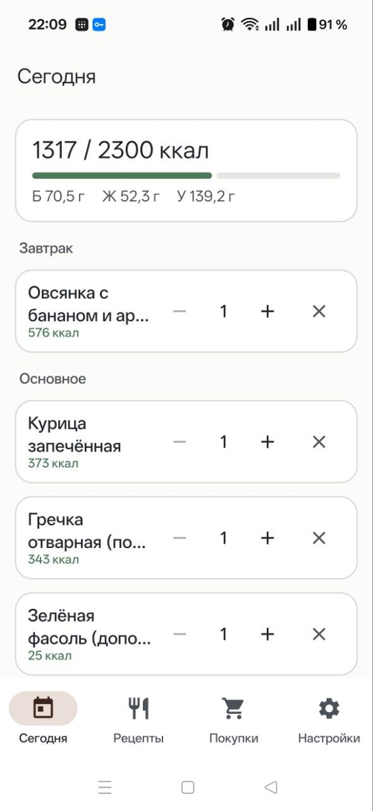
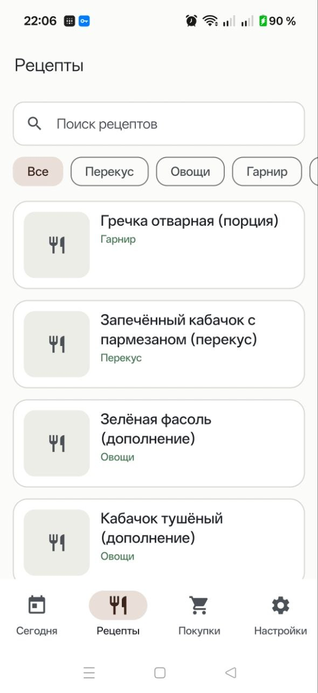
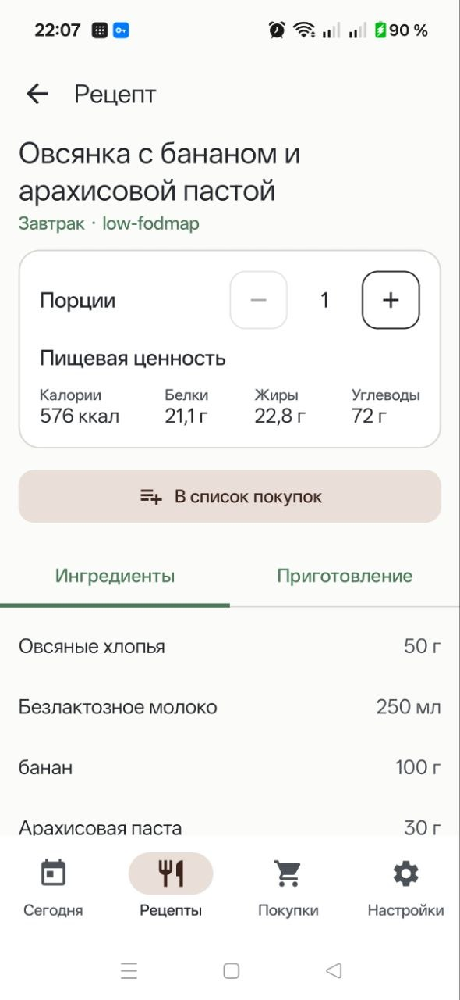
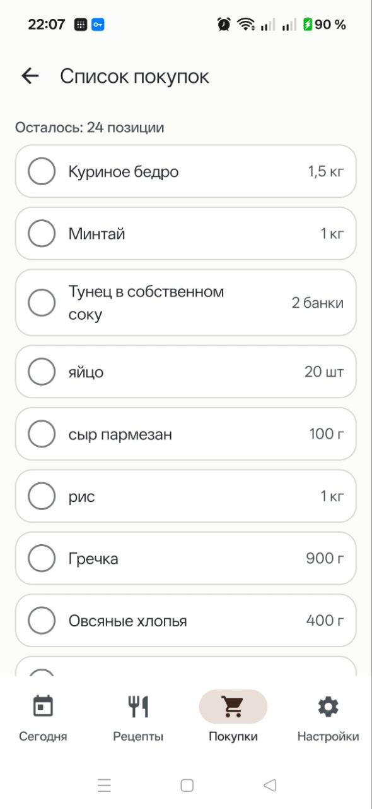

[Русский](README.md) | English

<div align="center">

# Mealio

**A native Android client for self-hosted [Mealie](https://mealie.io).**

Fast, minimal and designed for everyday meal planning, recipes and shopping.

[](https://developer.android.com)
[](https://kotlinlang.org)
[](https://developer.android.com/jetpack/compose)
[](https://github.com/arttvad9r/Mealio/actions/workflows/android-ci.yml)
[](https://github.com/arttvad9r/Mealio/releases)
[](LICENSE)

**[Download latest release](https://github.com/arttvad9r/Mealio/releases/latest)** ·
[All releases](https://github.com/arttvad9r/Mealio/releases)

</div>

Mealio talks directly to **your own Mealie server** over HTTP/JSON — no cloud,
no account, no middle layer. Your Mealie instance stays the single source of
truth; the app is just a fast native UI for it.

In short: recipes, a shopping list and daily meal planning in a simple Android
interface.

> **Mealio requires an existing, running Mealie server.** If you don't have one
> yet, start at [mealie.io](https://mealie.io) to learn how to self-host it.

> **Language.** Since **V1.3** (on `main`) the UI is localized: English is the
> default language, Russian is selectable in Settings. The documentation is
> available in English (this page) and Russian ([README.md](README.md)).

## Screenshots

<div align="center">
<table>
  <tr>
    <td align="center"></td>
    <td align="center"></td>
    <td align="center"></td>
    <td align="center"></td>
  </tr>
  <tr>
    <td align="center"><sub>Today</sub></td>
    <td align="center"><sub>Recipes</sub></td>
    <td align="center"><sub>Recipe</sub></td>
    <td align="center"><sub>Shopping</sub></td>
  </tr>
</table>
</div>

<sub>The screenshots show the V1.2 UI, which was Russian-only — see [Project status](#project-status). V1.3 adds an English UI on `main`.</sub>

## Features

- Native Android UI with Jetpack Compose and Material 3
- Connect to your own Mealie server (URL + long-lived API token)
- Browse and search recipes
- Filter recipes by category
- Recipe detail with ingredients, steps and nutrition
- Serving scaling with recomputed nutrition
- Shopping lists — view, check off and uncheck items
- Add recipe ingredients to a shopping list
- **Today** dashboard: build your day out of your own recipes
- Daily calorie total and macro breakdown (protein / fat / carbs)
- Meal slots (breakfast, main, side, vegetables, snack, extra) with serving adjustment
- Light / dark / system themes
- Secure API-token storage using the Android Keystore (AES/GCM)
- LAN- and Tailscale-friendly self-hosted usage

Mealio is intentionally **not** a calorie-tracking app and not a FatSecret
clone: there is no separate food database, no barcode scanner, no manual food
entry and no recommendations. It is a thin client for Mealie.

## Today

**Today** is the part that goes a little beyond a plain Mealie viewer — it's a
daily meal builder that reuses your own recipes:

- Pick recipes for **breakfast, main, side, vegetables, snack and extra**.
- Adjust the **servings** of each item.
- **Calories and macros** for the day are calculated from the nutrition already
  stored in your Mealie recipes.
- The current day is **stored locally** on the device, so it survives restarts.
- It **resets logically when the local date changes** — a new day starts clean.

## Requirements

- **Android 8.0+** (API 26)
- A running **Mealie server** with its API reachable from your phone
- A Mealie **long-lived API token**

## Installation

1. Download the APK from the [latest release](https://github.com/arttvad9r/Mealio/releases/latest).
2. Install it on your device (you may need to allow installs from unknown sources).
3. Open Mealio.
4. Enter your Mealie server URL.
5. Enter your long-lived API token.

### Getting an API token

In Mealie: **profile → API tokens → create a long-lived token**. Paste it into
Mealio's connection screen.

### Networking

Mealio works well for reaching a **home Mealie server over a private Tailscale
network** — no ports exposed to the internet, and the app just talks to the
server's Tailscale address.

> **Security note.** Plain `http://` is acceptable **only inside a trusted,
> private, already encrypted network** — a home LAN or a **Tailscale** network,
> where traffic runs inside the encrypted tunnel. For any server reachable from
> a public or untrusted network, use **`https://`**.

## Project status

Mealio is an **independent community project** and is **not affiliated with or
endorsed by** the Mealie project.

- **Current state:** a usable personal Android client, under active development.
- **UI languages:** English (default) and Russian — both in `main` since V1.3.

It is not marketed as production-grade or enterprise-stable software — it's a
small, focused app that works well for its author's own self-hosted setup.

## Development

Built with:

- Kotlin
- Jetpack Compose
- Material 3
- Retrofit / OkHttp
- Kotlin Serialization
- Coil
- Coroutines / Flow
- Android Keystore

Common commands (Gradle wrapper):

```bash
./gradlew assembleDebug        # build a debug APK
./gradlew testDebugUnitTest    # unit tests
./gradlew lintDebug            # lint
```

You need **JDK 17** and the **Android SDK** (platform 36, build-tools 36).
Notes for contributors, including API quirks and architecture, are in
[`AGENTS.md`](AGENTS.md); technical decisions are recorded as ADRs in
[`docs/adr/`](docs/adr/).

## Roadmap

**V1.4** is implemented on `main` and is being prepared for release (not published
yet — the latest release is still [v1.2](https://github.com/arttvad9r/Mealio/releases/latest)):

- **Cook Mode** — a step-by-step cooking view that keeps the screen on;
- timers straight from recipe steps: several independent timers that fire exactly
  on time — with sound and vibration — even while the app is in the background;
- the "Today" tab and the daily calorie target are hidden from the UI.

Possible future directions — no timelines promised, and only what actually fits
the project:

- Improve the Today workflow.
- Better recipe imagery and presentation.
- Additional shopping UX.
- Broader Mealie API coverage.

## Contributing

Issues and pull requests are welcome — see [CONTRIBUTING.md](CONTRIBUTING.md).
For security-related reports, see [SECURITY.md](SECURITY.md).

## License

MIT — see [LICENSE](LICENSE).
